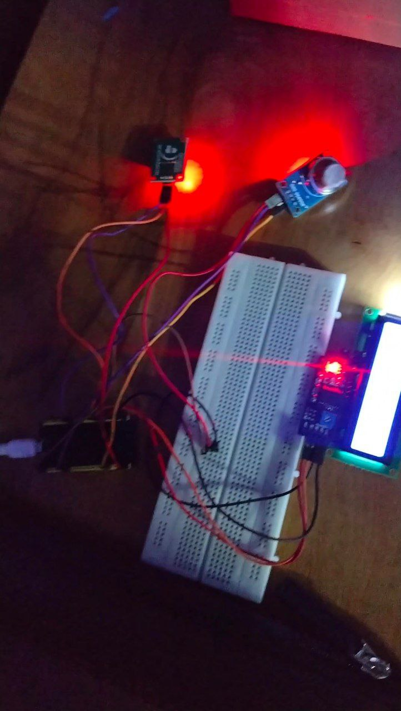
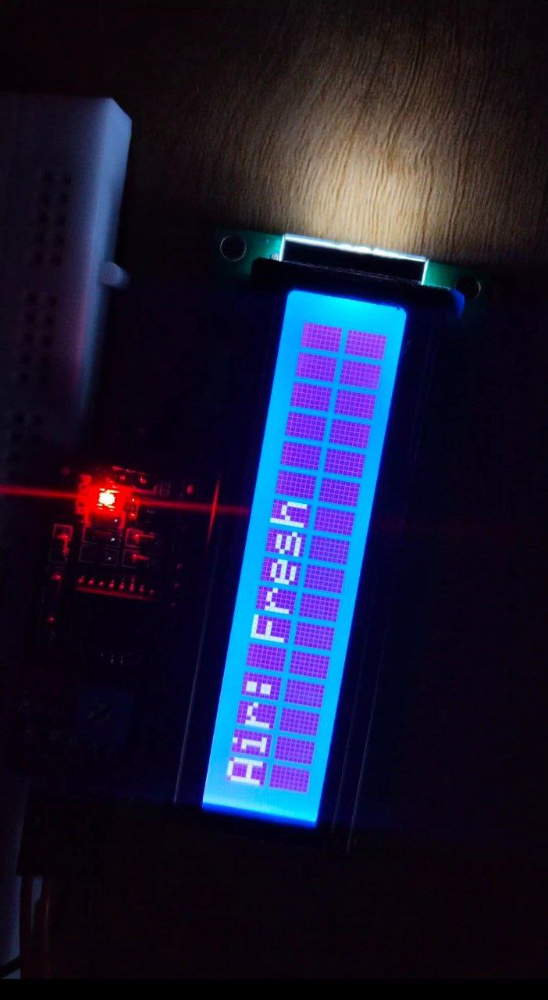
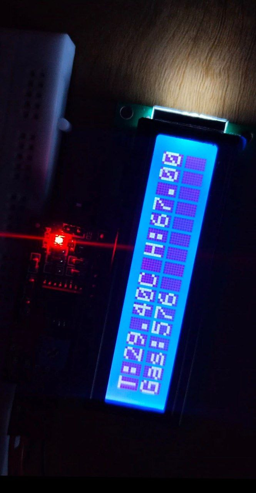

# 🌫️ ESP32 Air Quality Monitoring System

## 📌 Overview
IoT-based air quality monitoring system using **ESP32**, **DHT11**, and a **Gas Sensor**.  
Displays data on a 16x2 I2C LCD and sends real-time updates to Blynk.

---

## ⚙️ Features
- 🌡️ Temperature monitoring  
- 💧 Humidity monitoring  
- 🌫️ Gas level detection (ADC 0–4095)  
- 📲 Real-time Blynk dashboard  
- 🚨 Pollution alert notification  
- 📟 LCD live display  
- 🔄 Updates every 5 seconds  

---

## 🧩 Components
- ESP32  
- DHT11  
- MQ Gas Sensor  
- 16x2 I2C LCD  
- Jumper wires  
- WiFi connection  

---

## 🔌 Connections

## 🚨 Alert Condition
If gas value > **1500**:
- Sends alert notification  
- Displays **“Air: BAD”** on LCD

---

